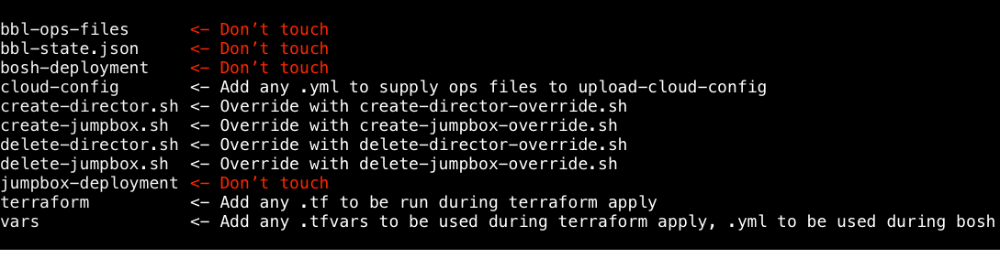

# Customizing your infrastructure and director

Since version 5.2.0, `bbl` has allowed customizing the infrastructure and director by editing files within the bbl state dir. This is a guide to which files can and can't
be customized.



## Files and directories that cannot be overridden or customized
There are 3 directories and one file in the `bbl` state directory which should not be modified by the user.

### `bbl-ops-files`
The `bbl-ops-files` directory contains ops files for `bosh-deployment` and `jumpbox-deployment` which are used by `bbl` but not part of the main `bosh-deployment` or
`jumpbox-deployment` repositories.

### `bbl-state.json`
The `bbl-state.json` file is used to keep track of several different aspects of state that aren't captured by the rest of the state dir:
- load balancer type, cert, and key
- most recent output from Terraform (useful when running without `--debug`; this will be printed when running `bbl latest-error`)
- BOSH director information, including:
  - username and password
  - address
  - SSL certificate, private key, and CA
- jumpbox URL
- environment name
- IAAS
- `bbl` version used to create the state

### `bosh-deployment`
This is a copy of the [cloudfoundry/bosh-deployment](https://github.com/cloudfoundry/bosh-deployment) Git repository. It contains the base BOSH director manifest, as well
as ops files that configure the CPI, add UAA and Credhub to the director, and allow SSH access to the director. The entire repository is provided, not just the files that
`bbl` uses in its default director `create-env` script.

### `jumpbox-deployment`
This is a copy of the [cloudfoundry/jumpbox-deployment](https://github.com/cloudfoundry/jumpbox-deployment) Git repository. It contains the base jumpbox manifest, as well
as ops files that configure the CPI. As with the `bosh-deployment` directory, the entire Git repository is provided, not just the files `bbl` uses.

## Override scripts
To create and destroy the jumpbox and director deployments, `bbl` does not shell out directly to the BOSH CLI. Instead, it uses four wrapper scripts, which are emitted into
the root of the state directory as `create-jumpbox.sh`, `create-director.sh`, `delete-jumpbox.sh`, and `delete-director.sh`. These files will be rewritten when running
`bbl plan`, so editing them directly is not recommended. However, if a file with the name `create-jumpbox-override.sh` is present in the root of the state directory,
`bbl` will run that script *instead* of `create-jumpbox.sh` when creating a jumpbox. The same goes for the other counterparts: `create-director-override.sh`, `delete-
jumpbox-override.sh`, and `delete-director-override.sh`.

## Directories where the user can add files

### `cloud-config`
Any ops file with a name of the form `*.yml` that is added to the `cloud-config` directory will be used as an ops file argument by `bbl` when it runs `update-cloud-config`.
The ops files will be applied in alphabetical order.

Modifying the `cloud-config.yml` and `ops.yml` files directly is not recommended if you can avoid it, as these files will be rewritten on `bbl plan`, while other files in
the directory will be preserved even if you re-run `bbl plan`.

### `terraform`
Adding an HCL file with a `*.tf` filename to the `terraform` directory will effectively *append* that file to the `bbl` terraform template. Adding an HCL file with a
`*_override.tf` filename will *merge* that file with the `bbl` terraform template when `bbl` runs `terraform apply` or `terraform destroy`. If you are modifying any `bbl`-
provided Terraform resources using a custom Terraform file, we recommend that you end your filename in `_override.tf` in order for Terraform to properly process those
modifications.

Changes to the `bbl.tf` file will be lost on re-running `bbl plan`, but all other files in the directory will not be modified.

### `vars`
Adding a file with a `*.tfvars` filename to the `vars` directory will allow custom variables to be picked up by Terraform when `bbl` runs `terraform apply`. The general
format of a `tfvars` file is `key="value"`. Values longer than one line can be provided using heredoc syntax, for instance:

```
aws_iam_access_policy = <<EOF
{
  "Version": "2012-10-17",
  "Statement": [
    {
      ...
    }
  ]
}
EOF
```

Modifying the `bbl.tfvars` file directly can change the variables used in the base Terraform template; however, this is not recommended since these variables are
generated by `bbl` from credentials and other user-provided settings and may be overwritten by subsequent `bbl` runs. Instead, you should alter the input to `bbl plan`.

`bbl` provides several files within the `vars` directory, and will edit them on subsequent runs. These files include:
- `bbl.tfvars` - used by `bbl` to provide credentials and other user-provided settings to Terraform
- `bosh-state.json` - used by the BOSH CLI to store state for the BOSH director deployment
- `cloud-config-vars.yml` - used by `bbl` to provide Terraform outputs to the BOSH cloud-config
- `director-vars-file.yml` - used by `bbl` to provide Terraform outputs to the BOSH create-env call for the director
- `director-vars-store.yml` - used by the BOSH CLI to store generated variables for the BOSH director deployment
- `jumpbox-state.json` - used by the BOSH CLI to store state for the jumpbox deployment
- `jumpbox-vars-file.yml` - used by `bbl` to provide Terraform outputs to the BOSH create-env call for the jumpbox
- `jumpbox-vars-store.yml` - used by the BOSH CLI to store generated variables for the BOSH jumpbox deployment
- `terraform.tfstate` and `terraform.tfstate.backup` - used by the Terraform CLI to store state

These files should not be edited by the user. All other files placed in the `vars` directory are safe and will not be modified by `bbl`.
